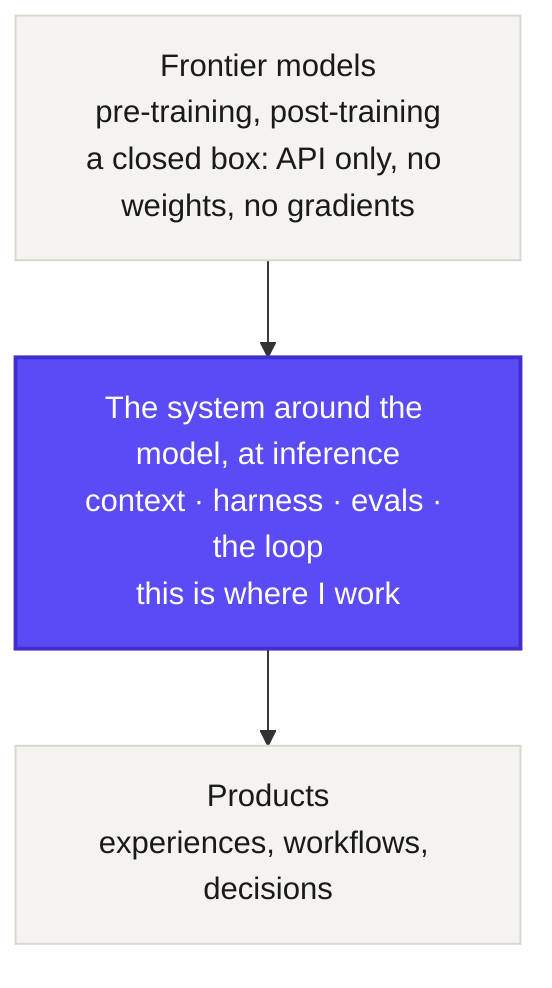

## Hi, I'm Kanish 👋

# I optimize the system around the model

**AI Engineer · black-box optimization of frontier-model systems, at inference**

Frontier models ship as closed boxes: no weights, no gradients, just an API you query. So the leverage has moved off training and onto inference. You optimize everything you can actually touch around the model, the context, the harness, the evals, the loop, to make a black box behave reliably. It is black-box optimization, at inference time. **The model is rarely the bottleneck. The system around it is.**

I've worked the other end of this too, post-training models that reached 100M+ users. Now I work in between, where a real organisation turns those models into something reliable.

## What I work on

The through-line is the tradeoffs that force the next decision, not the tools.

**Making a legacy enterprise agent-native**
- **The platform problem:** many teams contributing to and running on one agent platform without rewriting what they have. Versioning and feature flags, federating their own multi-agent / A2A systems, defence in depth at the API.
- **Packaging and progressive disclosure:** capabilities (tools, UI, prompts, guardrails) bundled, then loaded and unloaded on demand.
- **Evaluation and composition:** testing and owning behaviour no single team authored. Conflicting instructions, layered guardrails, the combinatorial cost.
- **Developer leverage, used securely:** engineers running many coding agents at once, with blast radius and reversibility as the frame.

**Building and running the agents**
- **The harness, and agent factories:** the scaffolding that sets the reliability ceiling, plus fleets on worktrees and supervision trees.
- **Generative UI:** interfaces the model composes at runtime, and the streaming, loop, and human-gate problems underneath.
- **An LLM-native knowledge base:** an agent-readable wiki that compounds instead of re-deriving on every query.
- **Memory:** what an agent should remember, where curation matters more than storage.

**Cutting across everything**
- **Context management:** the window is finite and degrades before it overflows. Compaction, prompt caching, sub-agent isolation.
- **Observability:** tracing and evaluating a system whose shape changes every run, and the failures only production reveals.

## Off the keyboard

Reading and running, mostly.
